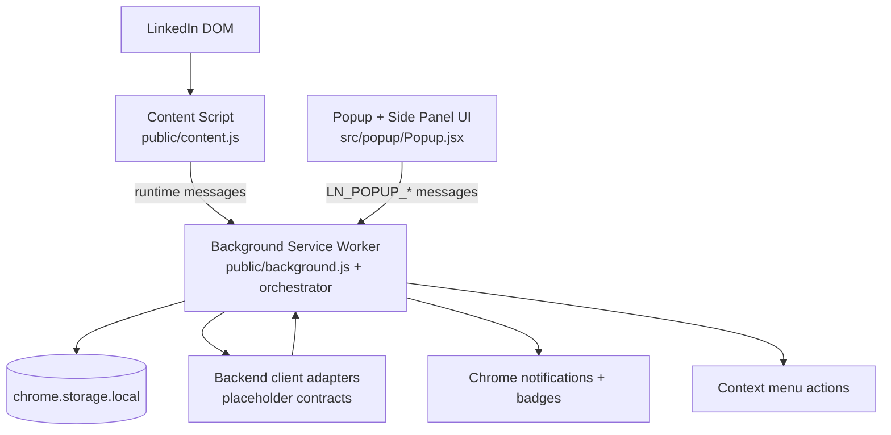

# LinkNest Extension (Extension-only Plan Scaffold)

This repository currently implements the Chrome extension side only.
Backend calls are placeholder methods with documented input/output contracts.

## Architecture

### Component map



### Module responsibilities

- `public/background.js`: registers the background orchestrator.
- `public/background/orchestrator.js`: central message routing, queue flushing, sync triggers, and state snapshots.
- `public/content.js`: LinkedIn profile/context extraction and shadow detection loop.
- `src/popup/Popup.jsx`: operator controls (refresh/suggest/settings), local telemetry, and event inbox (shared by popup + side panel entry points).
- `src/lib/*` and `shared/lib/*`: store utilities, normalization, and sync helpers.

## Event flow

### 1) Popup-driven refresh/suggestion flow

1. User clicks **Refresh targets** or **Generate suggestion** in popup.
2. Popup sends `LN_POPUP_REFRESH_TARGETS` or `LN_POPUP_REQUEST_SUGGESTION` to background.
3. Background validates message, performs sync/suggestion orchestration, updates `chrome.storage.local` keys.
4. Popup reloads state with `LN_POPUP_GET_STATE` and renders status, telemetry, and events.

### 2) Content extraction flow

1. Popup/background requests LinkedIn data from content script (`LN_EXTRACT_PROFILE_MINIMAL` or `LN_CAPTURE_SUGGESTION_CONTEXT`).
2. Content script reads minimally required DOM fields and returns normalized payload.
3. Background stores event/queue metadata and may call placeholder backend adapters.

### 3) Shadow session (name-only) flow

1. Background sends `LN_START_SHADOW` to content script with mode `name_only`.
2. Content script scans visible feed cards on interval and emits `LN_TARGET_DETECTED` when matches are found.
3. Background deduplicates/throttles, enqueues notifications/events, and persists session metadata.
4. Background sends `LN_STOP_SHADOW` to halt the interval loop.

## Known limitations

- **LinkedIn DOM fragility:** selectors rely on current LinkedIn markup and can break when class names or structure shift.
- **No automation actions:** the extension intentionally does not auto-like, auto-comment, auto-message, or auto-post.
- **Backend behavior is placeholder-only:** responses are contract-shaped mocks until a production backend is wired.

## Safe defaults checklist (PR review)

Use this checklist before merging extension behavior changes:

- [ ] Human-in-the-loop is preserved for all externally visible actions.
- [ ] No code path introduces auto-like/comment/message/post behavior.
- [ ] Data extraction remains minimal and purpose-limited.
- [ ] New storage keys are namespaced (`ln_*`) and documented.
- [ ] Event queues have caps/TTL or backoff strategy where appropriate.
- [ ] Message handlers validate type + payload shape before execution.
- [ ] Any new context-menu action is safe in quiet mode and failure-tolerant.
- [ ] UI copy avoids implying autonomous actions.

## Placeholder backend specs

See `src/types/contracts.md` for concise contract shapes.

## Developer runbook

### 1) Install and build

```bash
npm install
npm run build
```

### 2) Load unpacked extension (Chrome)

1. Open `chrome://extensions`.
2. Enable **Developer mode**.
3. Click **Load unpacked**.
4. Select this repository’s built output directory (`dist/`).
5. Pin the extension so popup access is easy while testing.

### 3) Simulate key flows

- **Unit tests:** `npm test`
- **Smoke journey:** `npm run test:smoke`
- **Manual refresh/suggest:** open popup and run **Refresh targets** + **Generate suggestion**.
- **LinkedIn extraction check:** open a LinkedIn profile tab, then trigger suggestion flow to verify profile/context extraction.
- **Shadow mode sanity check:** start a shadow session from extension controls/context menu, scroll feed, verify detections/events are bounded.

### 4) Inspect and edit storage during debugging

**Option A (recommended):**

1. In `chrome://extensions`, open **Service Worker** inspector for LinkNest.
2. In DevTools Console, run:

```js
await chrome.storage.local.get(null)
```

3. Inspect keys such as:
   - `ln_settings`
   - `ln_events`
   - `ln_sync_meta`
   - `ln_backend_status`
   - `ln_interaction_write_queue`
   - `ln_suggest_telemetry`

**Option B:**

- Application panel → Storage → Extension storage → `chrome.storage.local`.

### 6) Troubleshooting common MV3 load errors

If you see either of these errors in `chrome://extensions`:

- `An unknown error occurred when fetching the script.`
- `Service worker registration failed. Status code: 3`

check the following:

1. Use `npm run build` (not `rpm run build`).
2. Load **`dist/`** as the unpacked extension directory.
3. Run `npm run verify:build` to confirm `dist/manifest.json` and `dist/background.js` exist and match.
4. After rebuilding, click **Reload** on the extension card.

These errors usually mean Chrome cannot find the service worker file referenced by `background.service_worker` in `manifest.json`.

### 5) Changelog discipline

All behavior changes for extension runtime, message contracts, storage shape, or operator UX must be added to `CHANGELOG.md` in the next unreleased section.

## Changelog

See `CHANGELOG.md` for versioned extension behavior updates.
