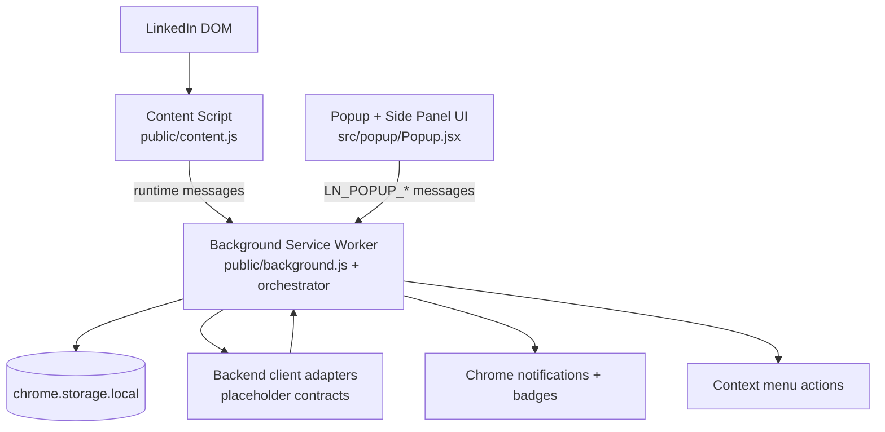

# LinkNest Extension

LinkNest is a Chrome extension that helps you **spot relevant LinkedIn activity**, **capture minimal context**, and **prepare suggestions** while keeping humans in control of final actions.

This README is intentionally written as a combined **User Guide + Developer Guide** so a new operator, QA tester, or engineer can quickly understand:

- what each feature does,
- which actions are available in the UI,
- where data is stored,
- how components communicate,
- and where to find deeper technical documentation.

---

## Table of contents

1. [What LinkNest does](#what-linknest-does)
2. [Feature and action guide (for users/operators)](#feature-and-action-guide-for-usersoperators)
3. [How LinkNest works under the hood (for developers)](#how-linknest-works-under-the-hood-for-developers)
4. [Documentation map (where to go deeper)](#documentation-map-where-to-go-deeper)
5. [Setup and local development](#setup-and-local-development)
6. [Testing and validation workflows](#testing-and-validation-workflows)
7. [Storage and debugging guide](#storage-and-debugging-guide)
8. [Troubleshooting](#troubleshooting)
9. [Safety boundaries and non-goals](#safety-boundaries-and-non-goals)
10. [Release and change-management expectations](#release-and-change-management-expectations)

---

## What LinkNest does

At a high level, LinkNest provides a structured workflow around LinkedIn monitoring and suggestion support:

- **Refresh Targets**: loads or refreshes target data used by extension workflows.
- **Generate Suggestion**: captures minimal page context and prepares suggestion data.
- **Shadow Detection (name-only mode)**: watches visible feed cards and reports detections for known names.
- **Event Inbox + Telemetry**: keeps a local event stream so operators can inspect recent extension behavior.
- **Notification/Badge support**: surfaces actionable events without performing autonomous social actions.

> Important: LinkNest does **not** auto-like, auto-comment, auto-message, or auto-post.

---

## Feature and action guide (for users/operators)

This section explains each feature as a practical user-facing workflow.

### 1) Open the extension UI

You can interact with LinkNest through:

- **Popup UI** (quick controls), and
- **Side panel UI** (same logical controls, roomier layout for investigation).

Typical first steps:

1. Pin the extension in Chrome.
2. Open LinkedIn in another tab.
3. Open the LinkNest popup.

### 2) Action: Refresh Targets

**What it does**

- Requests current target data refresh through the background service worker.
- Updates local state and status so UI components can display the latest target snapshot.

**When to use it**

- At the beginning of a working session.
- After changing backend configuration.
- After errors/timeouts to re-establish known-good local state.

**What you should expect**

- Updated status in popup/side panel.
- New event entries indicating refresh lifecycle.

### 3) Action: Generate Suggestion

**What it does**

- Captures minimal LinkedIn context from the active tab.
- Sends a suggestion request flow to background orchestration.
- Stores telemetry and related event metadata locally.

**When to use it**

- When you want draft guidance based on the current profile/feed context.
- After target refresh if you want context-aware output.

**What you should expect**

- A suggestion payload or fallback state rendered in the UI.
- Event log entries for request, completion, or failure.

### 4) Action: Start Shadow Session (name-only)

**What it does**

- Starts a content-script loop that scans visible feed cards.
- Emits detection events for configured names only.
- Uses dedupe + rate limiting so repeated detections do not spam storage/notifications.

**When to use it**

- During feed review sessions where you want awareness of tracked names.

**What you should expect**

- Incremental events as detections happen.
- Badge/notification updates (depending on settings and throttling).

### 5) Action: Stop Shadow Session

**What it does**

- Stops the scanning interval immediately.
- Leaves persisted events/session metadata available for inspection.

**When to use it**

- End of monitoring block.
- Whenever you switch tasks and no longer want feed scanning.

### 6) Event Inbox and telemetry interpretation

The UI event stream is your audit-friendly local view of what happened:

- refresh started/completed,
- suggestion requested/completed/failed,
- shadow detections,
- sync or backend-related health signals.

If behavior seems wrong, start troubleshooting from this event timeline before changing settings.

---

## How LinkNest works under the hood (for developers)

### Architecture overview



### Responsibility map by module

- `public/background.js`
  - Registers background runtime entrypoint.
- `public/background/orchestrator.js`
  - Central message routing, sync triggers, queue flushing, snapshot assembly.
- `public/content.js`
  - DOM extraction + shadow detection loops.
- `src/popup/Popup.jsx`
  - Operator controls and event/telemetry rendering.
- `src/lib/*`, `shared/lib/*`, `public/lib/*`
  - Shared stores, schema normalizers, sync/state helpers.

### Core event flows

#### Popup-driven refresh/suggestion flow

1. UI sends `LN_POPUP_REFRESH_TARGETS` or `LN_POPUP_REQUEST_SUGGESTION`.
2. Background validates message shape and orchestrates downstream work.
3. State is persisted in `chrome.storage.local`.
4. UI calls `LN_POPUP_GET_STATE` and re-renders.

#### Context extraction flow

1. Background/UI requests minimal profile/context capture (`LN_EXTRACT_PROFILE_MINIMAL` or `LN_CAPTURE_SUGGESTION_CONTEXT`).
2. Content script reads only required DOM fields.
3. Normalized payload returns to background for event/queue/state handling.

#### Shadow session flow

1. Background sends `LN_START_SHADOW` (`name_only`).
2. Content script scans feed cards on interval.
3. Detected targets emit `LN_TARGET_DETECTED`.
4. Background dedupes/throttles, logs events, and may notify.
5. `LN_STOP_SHADOW` halts scanning.

---

## Documentation map (where to go deeper)

Use this section as your index into purpose-specific docs.

### Backend and integration

- **`docs-backend-integration.md`**  
  Full endpoint-by-endpoint integration guide, wiring assumptions, and sequence-level behavior.
- **`docs-backend-auth-config.md`**  
  Auth setup and backend config expectations.
- **`docs-api-schema-examples.md`**  
  Concrete request/response schema examples.
- **`src/types/contracts.md`**  
  Source-of-truth contract shapes used by extension code.

### Messaging, retry, and state semantics

- **`docs-message-contracts.md`**  
  Runtime message definitions and payload expectations.
- **`docs-retry-error-semantics.md`**  
  Error classification, retry model, and backoff behaviors.
- **`docs-storage-schema.md`**  
  Storage key model and persisted state semantics.

### Security, quality, and release hygiene

- **`docs-security-privacy.md`**  
  Security and privacy boundaries for data handling.
- **`docs-release-smoke-checklist.md`**  
  Pre-release validation sequence and smoke checks.
- **`docs-documentation-audit.md`**  
  Documentation completeness review and identified gaps.

### Operational history

- **`CHANGELOG.md`**  
  Versioned behavior changes and release notes.

---

## Setup and local development

### 1) Install dependencies

```bash
npm install
```

### 2) Build extension artifacts

```bash
npm run build
```

### 3) Load unpacked extension in Chrome

1. Navigate to `chrome://extensions`.
2. Enable **Developer mode**.
3. Click **Load unpacked**.
4. Select this repository’s `dist/` directory.
5. Pin LinkNest for quick access to popup controls.

---

## Testing and validation workflows

### Unit + smoke

- Unit tests: `npm test`
- End-to-end smoke journey: `npm run test:smoke`
- Build integrity verification: `npm run verify:build`

### Manual operator journey (recommended)

1. Open LinkedIn tab.
2. Open LinkNest popup.
3. Click **Refresh Targets**.
4. Click **Generate Suggestion**.
5. Start **Shadow Session** and scroll feed.
6. Validate detections/events are bounded and understandable.
7. Stop shadow session.

---

## Storage and debugging guide

Inspect extension state through the service worker console.

### Recommended approach

1. Open LinkNest card in `chrome://extensions`.
2. Open **Service Worker** inspector.
3. Run:

```js
await chrome.storage.local.get(null)
```

### Common keys to inspect

- `ln_settings`
- `ln_events`
- `ln_sync_meta`
- `ln_backend_status`
- `ln_interaction_write_queue`
- `ln_suggest_telemetry`

Alternative: DevTools **Application → Extension storage → chrome.storage.local**.

---

## Troubleshooting

If Chrome reports either:

- `An unknown error occurred when fetching the script.`
- `Service worker registration failed. Status code: 3`

then run this checklist:

1. Rebuild with `npm run build`.
2. Confirm unpacked directory is `dist/`.
3. Run `npm run verify:build`.
4. Reload the extension card in `chrome://extensions`.

These failures usually indicate the built service worker file does not match `background.service_worker` in `manifest.json`.

---

## Safety boundaries and non-goals

Use these as hard constraints in implementation and review:

- Human-in-the-loop must remain intact for all external actions.
- No auto-like/comment/message/post behavior.
- Extraction must remain minimal and purpose-limited.
- Message handlers must validate type + payload shape.
- Event queues should remain capped/rate-limited and failure-tolerant.
- UI copy should not imply autonomous posting or outreach.

---

## Release and change-management expectations

Before merging behavior changes:

- update any affected docs in the list above,
- add entries to `CHANGELOG.md` for runtime/contract/storage/UX changes,
- execute smoke checks from `docs-release-smoke-checklist.md`.

Keeping README + deep-dive docs aligned is required for maintainability and safe backend handoff.
