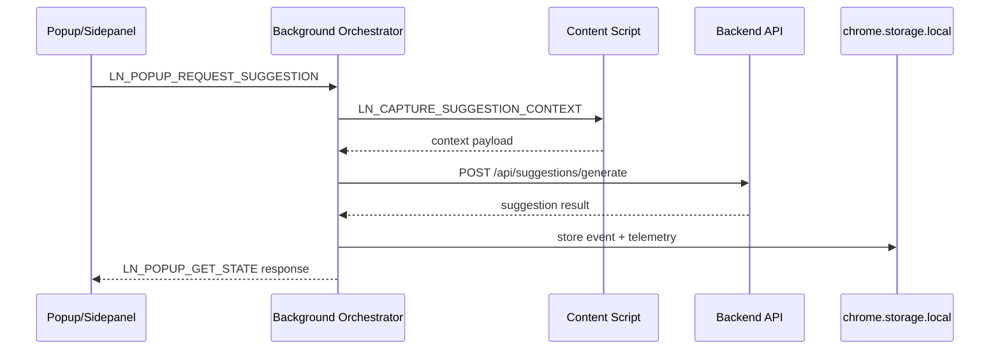
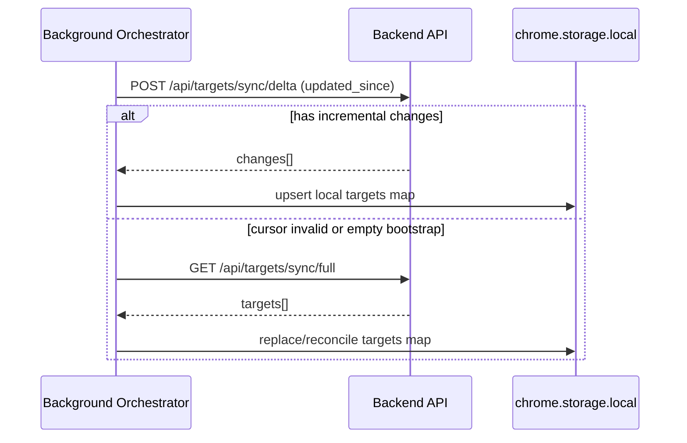

# Backend integration endpoints and flow

This document describes the backend routes the extension expects and how each route is used by the background orchestrator.

## Base URL and auth

- Configure a single backend base URL (for example `https://api.yourdomain.com`).
- All route paths below are relative to that base URL.
- Recommended auth: `Authorization: Bearer <token>` header from extension settings/session bootstrap.
- Recommended idempotency for write endpoints: include `Idempotency-Key` on retries.

## Endpoints to implement

| Capability | Method | Path | Called from extension flow | Request shape (minimum) | Response shape (minimum) |
|---|---|---|---|---|---|
| Upsert target | `POST` | `/api/targets/upsert` | Add target from profile or suggestion author prompt | `profile_url`, `display_name`, `headline?`, `source`, `captured_at` | `status`, `target_id`, `message` |
| Incremental sync | `POST` | `/api/targets/sync/delta` | Periodic/background target sync | `updated_since` | `changes[]` |
| Full sync recovery | `GET` | `/api/targets/sync/full` | Recovery when delta cursor is missing/invalid | (none) or `since` query | `targets[]` |
| Analyze profile fit (planned) | `POST` | `/api/targets/analyze` | Future profile analysis menu flow | profile summary payload | `decision`, `reason`, `confidence` |
| Start shadow session | `POST` | `/api/shadow/sessions` | User starts shadow mode | `started_at`, `mode` | `session_id`, `status` |
| Log target detection | `POST` | `/api/shadow/detections` | Content script emits detection | detection payload | `status` |
| Generate suggestion | `POST` | `/api/suggestions/generate` | Suggest response from post/comment/dm/manual context | `context_type`, `text`, `tone`, `context` | `suggestions[]`, `best_suggestion`, `confidence` |
| Fetch reminders | `GET` | `/api/reminders/followups` | Alarm-based reminders fetch | `since`, `limit` (query) | `reminders[]` |
| Batch interaction ingest | `POST` | `/api/interactions/batch` | Queue flush of interaction events | `events[]` | `accepted_count`, `rejected_count` |
| Ack notification | `POST` | `/api/notifications/ack` | Mark reminder/notification handled | notification identifier payload | `status` |

## Integration sequence (recommended)





## How to wire it (practical)

1. Replace placeholder return bodies in `public/background/backend.js` with real `fetch` calls.
2. Create a small helper (`requestBackend`) that centralizes:
   - base URL join
   - headers/auth
   - timeout + retry classification (5xx/network retry, 4xx no retry)
   - JSON parse + typed error wrapping
3. Keep current `withBackendRetry(...)` status recording, but call it around real network requests.
4. Preserve response keys expected by handlers (for example `best_suggestion`, `target_id`, `changes[]`).
5. For `GET /api/reminders/followups`, map extension payload to query params.
6. For `POST /api/interactions/batch`, keep batches bounded and idempotent.

## Suggested error contract

For non-2xx responses, return:

```json
{
  "error": {
    "code": "string_machine_code",
    "message": "human readable",
    "retryable": false
  }
}
```

This allows the extension to decide whether to requeue or surface a user-facing event.
